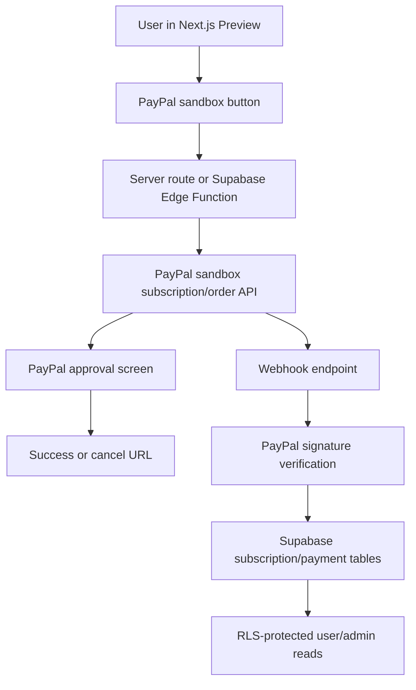

# ExpressJobs Payment Architecture

`PRODUCTION_STATUS=NO-GO_PRODUCTION`

## Target Architecture

## Principles

- Frontend can initiate checkout, but cannot grant premium.
- PayPal webhook is the source of truth for paid status.
- Supabase stores subscription state after verified webhook events.
- RLS lets a user read only their own subscription/payment state.
- Admin/internal audit reads require the existing admin role path.
- Sandbox must pass before live credentials are configured.

## Proposed Tables

Do not apply automatically in this audit cycle.

- `ej_subscriptions`
- `ej_payment_events`
- extend or replace `ej_payment_records` for provider-specific status

Minimum fields:

- `user_id`
- `provider`
- `provider_customer_id`
- `provider_subscription_id`
- `plan_key`
- `status`
- `current_period_start`
- `current_period_end`
- `last_event_id`
- `metadata`

## Proposed Routes

- `POST /api/payments/paypal/create-subscription`
- `POST /api/payments/paypal/webhook`
- `GET /pricing`
- `GET /account/billing`

## Feature Flags

- `ENABLE_PAYMENTS=false` by default.
- `PAYPAL_ENVIRONMENT=sandbox` for all pre-production testing.
- No PayPal live flag until production release gate.

## Decision

`PAYMENT_ARCHITECTURE=READY_FOR_SANDBOX_IMPLEMENTATION`
